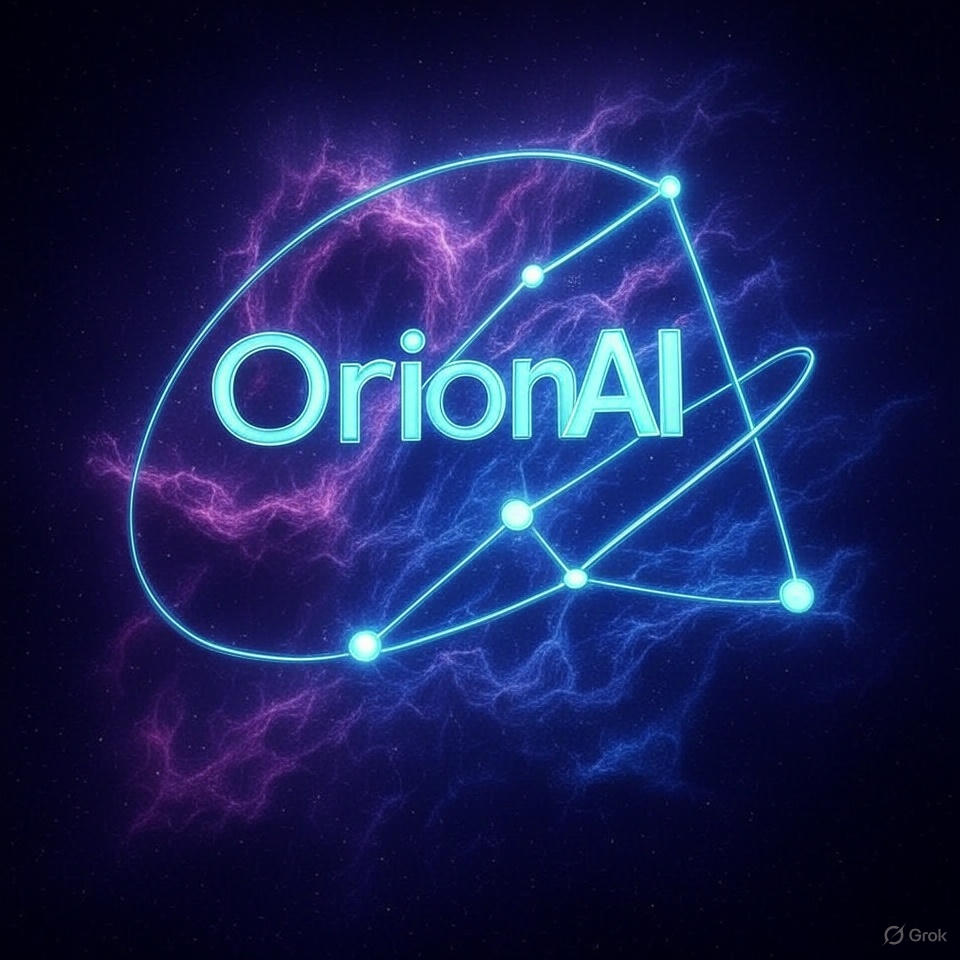

# OrionAI77/AI-Portfolio: My AI/ML Freelance Projects

This repository showcases my AI/ML freelance projects, demonstrating skills in machine learning and natural language processing.

## Projects

### 1. Iris Dataset Classifier
- **Description:** A classifier achieving 97% accuracy using scikit-learn on the Iris dataset.
- **Status:** Ready for client ML tasks!

### 2. Sentiment Analysis with Orion AI
- **Description:** A BERT-based sentiment analysis model trained on a custom dataset of 50 reviews, classifying text as positive, negative, or neutral. Achieves an evaluation loss of 0.7509.
- **Features:** Trained for 10 epochs with early stopping and cosine learning rate scheduling. Saved model available for inference.
- **Setup:** Install dependencies with `pip install -r requirements.txt` and run `python sentiment_analyzer.py`. Test with input, "exit" to quit, or "save" to export.
- **Results:** Eval loss dropped from 1.1686 to 0.7509 (see `combined_training_log.txt`). Sample prediction: "this product is amazing" -> positive.

## Setup
1. Clone the repo: `git clone https://github.com/OrionAI77/AI-Portfolio.git`
2. Install dependencies: `pip install -r requirements.txt`
3. Run projects as described.

## Logo

## Future Improvements
- Add more diverse training data.
- Fine-tune hyperparameters for better accuracy.

## License
© 2025 OrionAI77