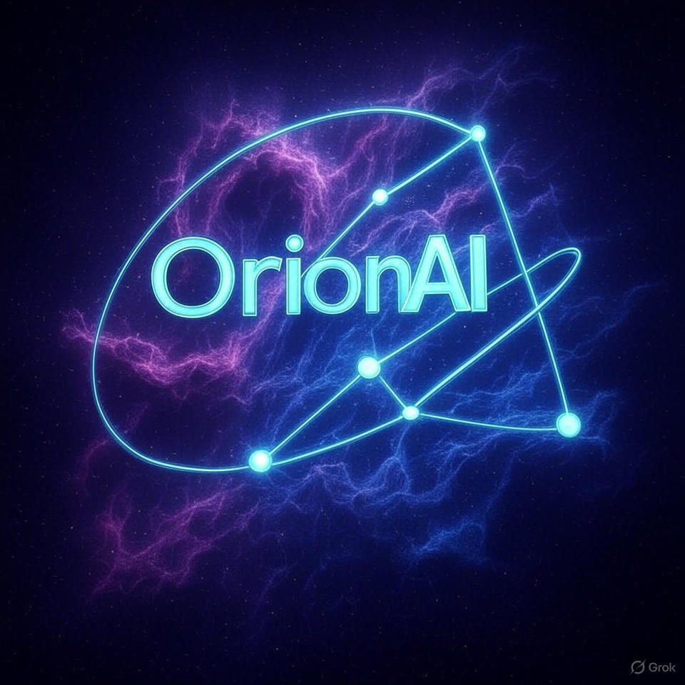

# OrionAI77/AI-Portfolio: My AI/ML Freelance Projects

Latest: Fully local daily Shorts bot for passive income content → [PassiveIncomeBot](PassiveIncomeBot/)

This repository showcases my AI/ML freelance projects, demonstrating skills in machine learning and natural language processing.

## Projects

1. **Iris Dataset Classifier**
   - Description: A classifier achieving 97% accuracy using scikit-learn on the Iris dataset.
   - Status: Ready for client ML tasks!

2. **Sentiment Analysis with Orion AI**
   - Description: A BERT-based sentiment analysis model trained on a custom dataset of 50 reviews, classifying text as positive, negative, or neutral. Achieves an evaluation loss of 0.7509.
   - Features: Trained for 10 epochs with early stopping and cosine learning rate scheduling. Saved model available for inference.
   - Setup: Install dependencies with `pip install -r requirements.txt` and run `python sentiment_analyzer.py`. Test with input, "exit" to quit, or "save" to export.
   - Results: Eval loss dropped from 1.1686 to 0.7509 (see combined_training_log.txt). Sample prediction: "this product is amazing" → positive.

## Additional Projects

**Passive Income Shorts Bot**  
A fully local, zero-cost daily generator for faceless YouTube Shorts in the personal finance & investing niche.

**Folder**: [PassiveIncomeBot](PassiveIncomeBot/)  
**Status**: Working (v1.0 – text frames + spiced visuals + natural voiceover)

**Core features**  
- AI-generated scripts using deepseek-r1:32b (via Ollama)  
- Clean, big readable text overlays with dark cyber-finance aesthetic  
- Natural male voiceover (Microsoft edge-tts)  
- One-command manual run or fully automatic via Windows Task Scheduler  

**Tech stack**  
- Ollama + langchain-ollama  
- edge-tts (voice)  
- FFmpeg (video assembly)  
- Pillow (frame generation)  

**Quick run (manual)**  
```powershell
Press Enter for default topic or type your own.
Daily auto-run (Task Scheduler)

Trigger: Daily at 8:00 AM
Program: python
Arguments: "C:\Users\along\Downloads\ComfyUI_windows_portable_nvidia\PassiveIncomeBot\generate_daily_short.py"
Start in: same folder

Future plans

Integrate real Flux.1 images for pro-level visuals
Auto-post finished videos to X @FukUrselv
Add looping background animations or video overlays

This bot is 100% offline/local — no cloud APIs, no ongoing costs.
Setup

Clone the repo: git clone https://github.com/OrionAI77/AI-Portfolio.git
Install dependencies: pip install -r requirements.txt
Run projects as described.

Logo

Future Improvements

Add more diverse training data.
Fine-tune hyperparameters for better accuracy.

Future Plans

Expand dataset for sentiment analysis.
Develop more AI tools for freelance clients.

License
© 2025 OrionAI77
